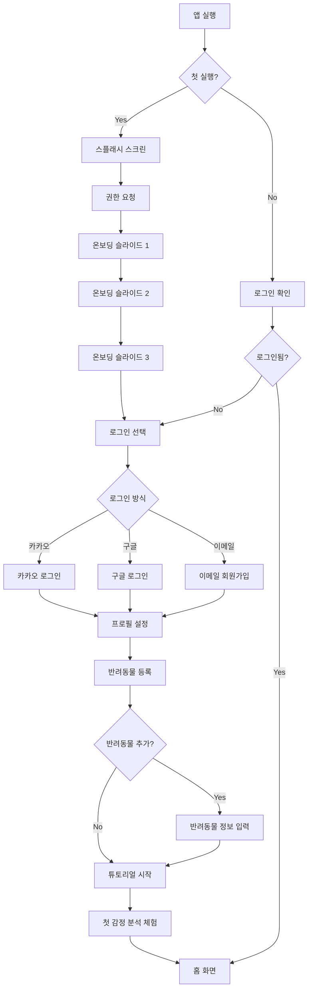
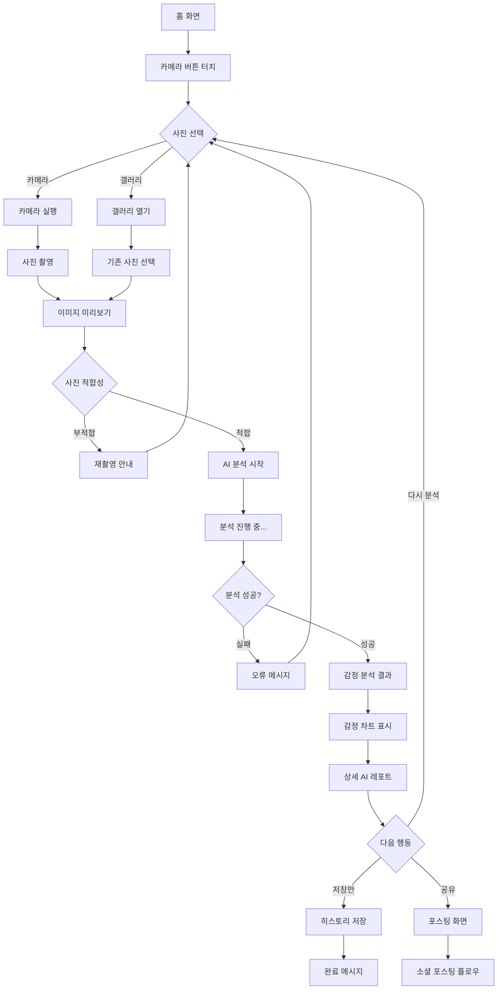
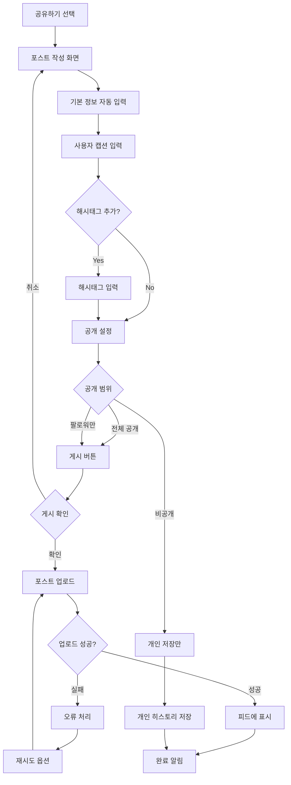
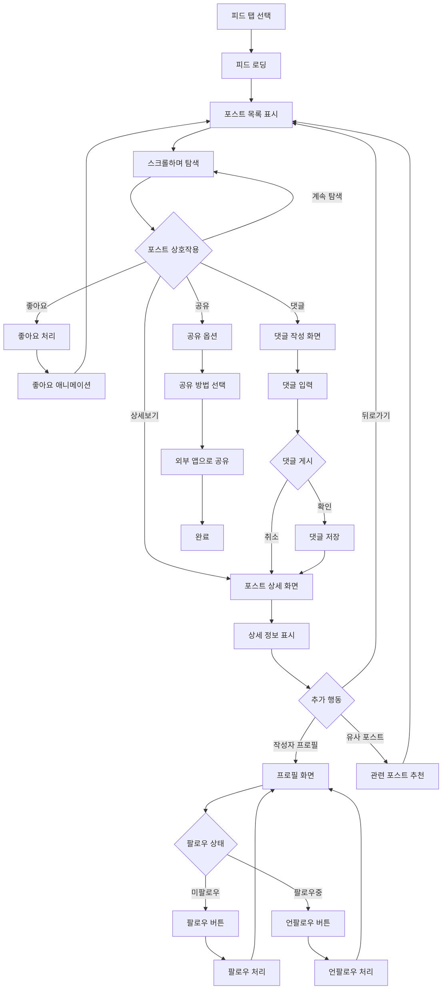
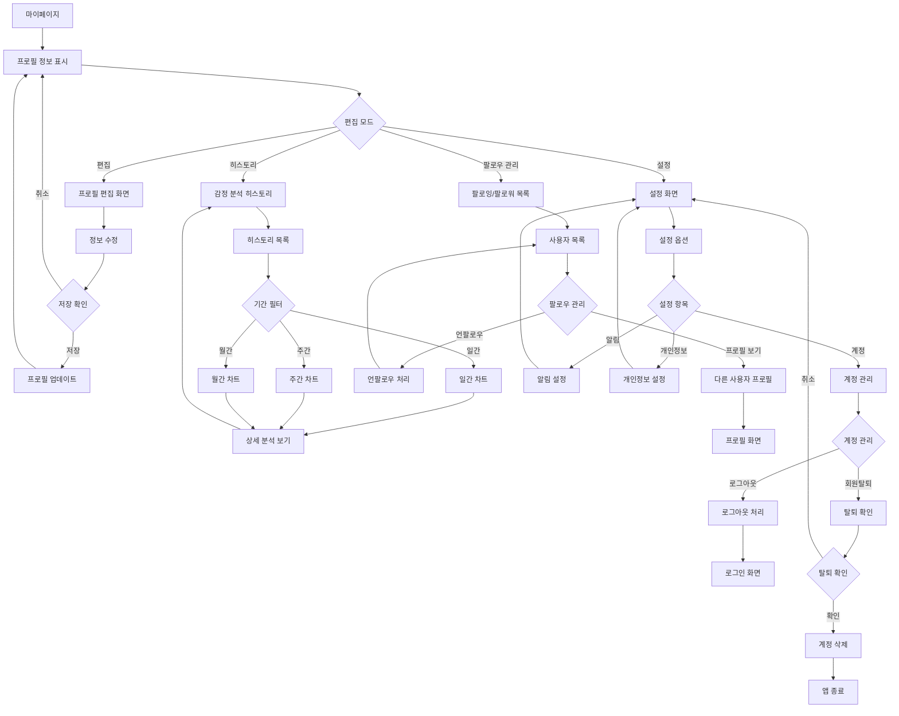

# PRD (Product Requirement Document) - 펫페이스

## 목차
1. [문서 개요](#문서-개요)
2. [프로젝트 개요](#프로젝트-개요)
3. [비전과 목표](#비전과-목표)
4. [사용자 페르소나](#사용자-페르소나)
5. [주요 기능 목록](#주요-기능-목록)
6. [사용자 시나리오](#사용자-시나리오)
7. [성공 지표](#성공-지표)

---

## 문서 개요

### 문서 목적
본 문서는 "펫페이스" 모바일 애플리케이션의 제품 요구사항을 구체적으로 명시하여, 개발팀이 사용자 중심의 제품을 구축할 수 있도록 가이드라인을 제공한다.

### 대상 독자
- 제품 기획자
- 개발팀 (프론트엔드, 백엔드, AI 개발자)
- 디자이너
- QA 엔지니어

---

## 프로젝트 개요

### 프로젝트 명
펫페이스

### 프로젝트 성격
반려동물 케어 + 소셜 네트워킹 + AI 감정 분석 서비스

### 핵심 가치 제안
- **정확성**: AI 기반 과학적 감정 분석으로 반려동물의 감정 상태를 객관적으로 파악
- **사용자 경험**: 직관적이고 재미있는 UX로 일상적인 사용 유도
- **커뮤니티**: 반려인들 간의 따뜻한 소통과 정보 공유 플랫폼

---

## 비전과 목표

### 비전
AI 기술로 반려동물의 감정을 과학적으로 분석하고, 반려인들이 서로 소통하며 더 나은 반려동물 케어 문화를 만드는 플랫폼

### 목표
- 데이터 기반으로 반려동물의 감정 상태를 정확하게 이해할 수 있는 도구 제공
- 반려인 커뮤니티를 통한 케어 노하우 및 경험 공유 활성화
- 반려동물과의 유대감 강화 및 더 나은 케어 문화 조성

### 해결하고자 하는 문제
1. **감정 파악의 어려움**: "우리 강아지가 지금 어떤 기분인지 정확히 모르겠어요"
2. **기록 관리의 부재**: "반려동물 감정 상태를 객관적으로 기록하고 싶은데 방법이 없어요"
3. **소통 및 공유 욕구**: "다른 반려인들과 우리 아이 자랑도 하고 케어 정보도 공유하고 싶어요"

---

## 사용자 페르소나

### Primary Persona: 김멍냥 (29세, 직장인)
**기본 정보**
- 나이: 29세
- 직업: IT 회사 마케터
- 반려동물: 말티즈 "몽이" (3세)
- 거주지: 서울 강남구 원룸

**특징 및 니즈**
- SNS 활동을 즐기며, 일상을 기록하고 공유하는 것을 좋아함
- 반려동물의 건강과 감정 상태에 매우 관심이 많음
- 과학적이고 객관적인 정보를 선호함
- 다른 반려인들과의 소통을 통해 케어 노하우를 배우고 싶어함
- 바쁜 일상 중에도 간편하게 사용할 수 있는 도구를 원함

**기술 사용 패턴**
- 스마트폰 사용 시간: 일일 4-5시간
- 주로 사용하는 앱: 인스타그램, 카카오톡, 네이버 블로그
- 새로운 기술에 대한 수용도가 높음

### Secondary Persona: 박반려 (35세, 주부)
**기본 정보**
- 나이: 35세
- 직업: 전업주부
- 반려동물: 페르시안 고양이 "냥순이" (5세)
- 거주지: 경기도 분당구 아파트

**특징 및 니즈**
- 반려동물과 함께하는 시간이 많아 세심한 관찰이 가능
- 반려동물의 미세한 변화도 감지하고 기록하고 싶어함
- 커뮤니티 활동을 통해 다른 반려인들과 정보 교환을 즐김
- 전문적인 케어 정보에 대한 관심이 높음

---

## 주요 기능 목록

### 핵심 기능 (MVP)
1. **AI 감정 분석 기능**
   - 사진 촬영/업로드 기능
   - 실시간 감정 분석 (기쁨, 슬픔, 불안, 졸림 등)
   - 감정 점수 및 신뢰도 표시

2. **감정 분석 결과 시각화**
   - 실시간 감정 차트
   - 개인 AI 레포트 생성
   - 히스토리 관리 (일/주/월 단위)

3. **소셜 네트워킹 기능**
   - 포스팅 (사진 + 감정 분석 결과)
   - 좋아요, 댓글 시스템
   - 팔로우/팔로워 관리
   - 피드 탐색 및 검색

4. **사용자 계정 관리**
   - 회원가입/로그인 (카카오, 구글 연동)
   - 프로필 관리
   - 반려동물 정보 등록

### 부가 기능 (향후 개발)
1. **커뮤니티 고도화**
   - 해시태그 시스템
   - 지역별 반려인 매칭
   - 그룹 채팅 기능

2. **데이터 분석 강화**
   - 감정 변화 추이 분석
   - 행동 패턴 인사이트
   - 맞춤형 케어 제안

3. **전문가 연결**
   - 수의사 상담 서비스
   - 전문가 Q&A
   - 응급 상황 가이드

---

## 사용자 시나리오

### 시나리오 1: 첫 사용자 온보딩
**상황**: 김멍냥씨가 처음 앱을 설치하고 사용하는 경우

1. **앱 다운로드 및 실행**
   - 앱스토어에서 "펫페이스" 검색 후 설치
   - 앱 실행 시 온보딩 화면에서 서비스 소개 확인

2. **계정 생성**
   - 카카오 계정으로 간편 로그인
   - 기본 프로필 정보 입력 (닉네임, 지역)

3. **반려동물 등록**
   - 반려동물 정보 입력 (이름, 종, 나이, 성별)
   - 대표 사진 등록

4. **첫 감정 분석 체험**
   - 튜토리얼을 통해 사진 촬영 방법 학습
   - 반려동물 사진 촬영 후 AI 분석 결과 확인
   - 분석 결과에 대한 설명 및 가이드 제공

### 시나리오 2: 일상적인 감정 분석 및 공유
**상황**: 평소 사용자가 반려동물의 감정을 분석하고 커뮤니티에 공유하는 경우

1. **감정 분석**
   - 홈 화면에서 카메라 버튼 터치
   - 반려동물 사진 촬영 (또는 갤러리에서 선택)
   - AI 분석 진행 (약 3-5초)
   - 감정 분석 결과 확인 (기쁨 80%, 호기심 15%, 졸림 5%)

2. **결과 해석 및 기록**
   - 상세 AI 레포트 확인
   - 개인 메모 추가 (상황 설명, 특이사항 등)
   - 히스토리에 자동 저장

3. **커뮤니티 공유**
   - "공유하기" 버튼 선택
   - 포스트 작성 (사진, 감정 분석 결과, 개인 코멘트)
   - 해시태그 추가 (#행복한월요일 #몽이일상)
   - 피드에 게시

4. **소셜 상호작용**
   - 다른 사용자들의 좋아요, 댓글 확인
   - 비슷한 감정 상태의 다른 반려동물 포스트 탐색
   - 댓글을 통한 케어 팁 교환

### 시나리오 3: 감정 변화 추적 및 관리
**상황**: 반려동물의 감정 변화를 장기적으로 추적하고 관리하는 경우

1. **주간 리포트 확인**
   - 마이페이지에서 "주간 리포트" 선택
   - 최근 7일간 감정 변화 차트 확인
   - 평소보다 슬픔 지수가 높았던 날 확인

2. **상세 분석**
   - 특정 날짜 클릭하여 상세 정보 확인
   - 해당 날의 모든 감정 분석 결과 및 메모 검토
   - 감정 변화의 원인 추측 및 기록

3. **커뮤니티 상담**
   - 우려사항을 커뮤니티에 포스팅
   - 다른 반려인들의 경험담 및 조언 수집
   - 필요시 전문가 상담 예약 (향후 기능)

---

## 성공 지표

### 핵심 지표 (KPI)
1. **사용자 참여도**
   - 일일 활성 사용자 (DAU): 월 1,000명 이상
   - 월간 활성 사용자 (MAU): 월 5,000명 이상
   - 사용자 리텐션율: 7일 50%, 30일 30% 이상

2. **콘텐츠 생성**
   - 일일 감정 분석 수행 횟수: 평균 3,000회 이상
   - 일일 포스팅 수: 평균 500개 이상
   - 사용자당 평균 포스팅 수: 월 10개 이상

3. **커뮤니티 활성도**
   - 포스트당 평균 좋아요 수: 5개 이상
   - 포스트당 평균 댓글 수: 2개 이상
   - 월간 팔로우 관계 생성 수: 1,000건 이상

### 품질 지표
1. **AI 정확도**
   - 감정 분석 정확도: 80% 이상
   - 사용자 만족도 (분석 결과): 4.0/5.0 이상
   - 오분석 신고율: 5% 이하

2. **기술 성능**
   - 앱 로딩 시간: 3초 이내
   - 감정 분석 처리 시간: 5초 이내
   - 앱 크래시율: 1% 이하

3. **사용자 만족도**
   - 앱스토어 평점: 4.5/5.0 이상
   - NPS (Net Promoter Score): 50 이상
   - 고객 지원 만족도: 90% 이상

---
---

# Prompt Design (개발 마일스톤 포함) - 펫페이스

## 목차
1. [문서 개요](#문서-개요-1)
2. [개발 마일스톤](#개발-마일스톤)
3. [단계별 개발 프롬프트](#단계별-개발-프롬프트)
4. [프롬프트 실행 가이드](#프롬프트-실행-가이드)

---

## 문서 개요

### 문서 목적
본 문서는 AI가 "펫페이스" 애플리케이션을 단계별로 구현할 수 있도록 설계된 개발 프롬프트 모음집이다. 각 프롬프트는 독립적으로 실행 가능하며, 작은 기능부터 점진적으로 전체 애플리케이션을 완성하는 구조로 설계되었다.

### 대상 독자
- AI 개발 어시스턴트
- 개발팀 리더
- 프로젝트 매니저

### 프롬프트 설계 원칙
- 각 프롬프트는 독립적으로 실행 가능
- 소스코드 샘플 없이 요구사항만으로 구성
- 작은 기능부터 점진적 개발 방식
- 명확하고 구체적인 지시사항 제공

---

## 개발 마일스톤

### 마일스톤 1: 기본 앱 구조 및 인증 (Week 1-2)
- Flutter 프로젝트 초기 설정
- Supabase 연동 및 인증 시스템
- 기본 UI 프레임워크 구축
- 소셜 로그인 (카카오, 구글) 구현

### 마일스톤 2: 핵심 기능 구현 (Week 3-5)
- 이미지 촬영/선택 기능
- AI 감정 분석 연동
- 감정 분석 결과 시각화
- 개인 히스토리 관리

### 마일스톤 3: 소셜 기능 구현 (Week 6-8)
- 포스팅 시스템
- 피드 및 탐색 기능
- 좋아요, 댓글 시스템
- 팔로우/팔로워 관리

### 마일스톤 4: 고도화 및 최적화 (Week 9-10)
- 성능 최적화
- 오프라인 지원
- 푸시 알림
- 사용자 경험 개선

### 마일스톤 5: 배포 및 운영 (Week 11-12)
- 앱스토어 배포 준비
- 분석 및 모니터링 설정
- 버그 수정 및 안정화
- 사용자 피드백 반영

---

## 단계별 개발 프롬프트

## STEP 1: Flutter 프로젝트 초기 설정

### 프롬프트 1-1: 기본 프로젝트 생성
```
**요구사항**
1. 앱 이름: 펫페이스
2. 패키지명: com.meongnyangdiary.app
3. Flutter 3.19 이상 사용
4. Material 3 디자인 적용
5. Supabase 관련 dependencies 설정

**구현해야 할 파일들:**
1. pubspec.yaml - Supabase 및 필수 의존성 정의
2. main.dart - 앱 진입점
3. android/app/src/main/AndroidManifest.xml - 기본 권한 설정
4. ios/Runner/Info.plist - iOS 권한 설정

**필수 패키지:**
- supabase_flutter
- image_picker
- cached_network_image
- flutter_bloc
- get_it

**기능 요구사항:**
- Material 3 테마 적용
- 다크모드 지원
- 기본 라우팅 설정
- 카메라, 갤러리 접근 권한 설정

각 파일의 기본 구조와 설정을 완성해주세요.
```

### 프롬프트 1-2: Supabase 초기 설정
```
**요구사항**
1. Supabase 프로젝트 연동 설정
2. Supabase Authentication 설정
3. PostgreSQL Database 연결 설정
4. Supabase Storage 설정
5. 실시간 구독 기본 설정

**구현해야 할 기능들:**
1. Supabase 클라이언트 초기화
2. 환경 변수 관리 (API URL, anon key)
3. 기본 SupabaseClient 설정
4. 에러 핸들링 기본 구조

**제약 조건:**
- 환경별 설정 분리 (dev, prod)
- .env 파일을 통한 보안키 관리
- 자동 토큰 갱신 설정

Supabase 연동을 위한 모든 기본 설정을 완성해주세요.
```

### 프롬프트 1-3: 앱 기본 구조 및 상태관리
```
**요구사항**
1. BLoC 패턴 기반 상태관리 구조
2. 의존성 주입 (GetIt) 설정
3. 기본 레이아웃 및 네비게이션 구조
4. 공통 컴포넌트 기본 틀

**구현해야 할 구조:**
1. lib/core/ - 공통 유틸리티
2. lib/features/ - 기능별 모듈
3. lib/shared/ - 공유 컴포넌트
4. lib/config/ - 설정 파일들

**기능 요구사항:**
- 하단 네비게이션 바 (홈, 피드, 프로필)
- 공통 AppBar 컴포넌트
- 로딩, 에러 상태 공통 처리
- 테마 색상 및 스타일 정의

Clean Architecture 원칙에 따른 기본 프로젝트 구조를 완성해주세요.
```

## STEP 2: 인증 시스템 구현

### 프롬프트 2-1: Supabase 소셜 로그인 구현
```
**요구사항**
1. 카카오 로그인 연동 (Supabase OAuth)
2. 구글 로그인 연동 (Supabase OAuth)
3. Supabase Authentication 활용
4. 로그인 상태 관리

**구현해야 할 화면들:**
1. 로그인 화면 - 소셜 로그인 버튼들
2. 온보딩 화면 - 서비스 소개 슬라이드
3. 권한 요청 화면

**기능 요구사항:**
- Supabase Auth의 signInWithOAuth 사용
- 자동 로그인 기능 (세션 유지)
- 로그아웃 기능
- 로그인 에러 처리

**UI/UX 가이드:**
- 따뜻하고 친근한 파스텔 톤 적용
- 큰 버튼과 명확한 CTA
- 로딩 상태 표시

Supabase OAuth를 활용한 소셜 로그인 기능을 완전히 작동하도록 구현해주세요.
```

### 프롬프트 2-2: 사용자 프로필 관리
```
**요구사항**
1. 사용자 프로필 생성 및 수정
2. 프로필 이미지 업로드 (Supabase Storage)
3. PostgreSQL users 테이블 연동
4. 프로필 정보 유효성 검증

**구현해야 할 화면들:**
1. 프로필 설정 화면
2. 프로필 편집 화면
3. 이미지 선택 및 업로드 화면

**데이터베이스 테이블:**
- users: id(UUID), email, display_name, photo_url, created_at, updated_at

**기능 요구사항:**
- Supabase Storage를 통한 이미지 업로드
- 중복 닉네임 검증 (PostgreSQL 쿼리)
- 실시간 프로필 정보 동기화
- Row Level Security (RLS) 적용

Supabase를 활용한 사용자 프로필 관리 기능을 완성해주세요.
```

### 프롬프트 2-3: 반려동물 등록 시스템
```
**요구사항**
1. 반려동물 정보 등록
2. 반려동물 프로필 이미지 업로드
3. 다중 반려동물 관리
4. 반려동물 정보 수정/삭제

**구현해야 할 화면들:**
1. 반려동물 등록 화면
2. 반려동물 목록 화면
3. 반려동물 상세 정보 화면

**데이터베이스 테이블:**
- pets: id(UUID), owner_id(FK), name, species, breed, age, gender, photo_url

**기능 요구사항:**
- PostgreSQL Foreign Key 관계 설정
- 품종 자동완성 기능
- 반려동물 프로필 카드 UI
- 기본 반려동물 선택 기능

PostgreSQL 관계형 데이터베이스를 활용한 반려동물 등록 및 관리 시스템을 완성해주세요.
```

## STEP 3: 감정 분석 핵심 기능

### 프롬프트 3-1: 이미지 촬영 및 선택
```
**요구사항**
1. 카메라로 사진 촬영 기능
2. 갤러리에서 사진 선택 기능
3. 이미지 미리보기 및 편집
4. 이미지 품질 검증

**구현해야 할 화면들:**
1. 카메라 촬영 화면
2. 이미지 미리보기 화면
3. 이미지 편집 화면 (크롭, 회전)

**기능 요구사항:**
- 정사각형 크롭 가이드
- 이미지 해상도 최적화
- 얼굴 인식 영역 표시
- 재촬영 기능

**제약 조건:**
- 최대 이미지 크기: 5MB
- 지원 포맷: JPG, PNG
- 최소 해상도: 500x500px

이미지 촬영 및 선택 기능을 완성해주세요.
```

### 프롬프트 3-2: AI 감정 분석 연동 (Supabase Edge Functions)
```
**요구사항**
1. Supabase Edge Functions를 통한 Google Vision API 연동
2. 얼굴 인식 및 감정 분석
3. 분석 결과 데이터 처리
4. 신뢰도 및 정확도 계산

**구현해야 할 기능들:**
1. Edge Function 작성 (Deno/TypeScript)
2. 클라이언트에서 Edge Function 호출
3. 감정 데이터 파싱 및 저장
4. 에러 처리 및 재시도 로직

**분석 감정 종류:**
- 기쁨 (happiness)
- 슬픔 (sadness)
- 불안 (anxiety)
- 졸림 (sleepiness)
- 호기심 (curiosity)

**Supabase 구성:**
- Edge Function: analyze-emotion
- Storage: 분석 이미지 저장
- Database: emotion_history 테이블 저장

Supabase Edge Functions를 활용한 AI 감정 분석 연동 기능을 완성해주세요.
```

### 프롬프트 3-3: 감정 분석 결과 시각화
```
**요구사항**
1. 감정 분석 결과 차트 표시
2. 감정별 상세 정보 제공
3. AI 레포트 생성
4. PostgreSQL에 히스토리 저장

**구현해야 할 화면들:**
1. 분석 결과 메인 화면
2. 감정 차트 (도넛, 바 차트)
3. 상세 AI 레포트 화면

**시각화 요구사항:**
- 감정별 퍼센테이지 표시
- 색상 코딩 (기쁨=노랑, 슬픔=파랑 등)
- 애니메이션 효과
- 신뢰도 인디케이터

**데이터베이스 연동:**
- emotion_history 테이블에 결과 저장
- JSONB 컬럼 활용 (emotion_analysis)

감정 분석 결과 시각화 기능을 완성해주세요.
```

### 프롬프트 3-4: 개인 히스토리 관리
```
**요구사항**
1. 감정 분석 기록 저장 및 조회
2. 시간별/일별/주별 히스토리 조회
3. PostgreSQL 쿼리를 통한 감정 변화 트렌드 분석
4. 데이터 내보내기 기능

**구현해야 할 화면들:**
1. 히스토리 메인 화면
2. 상세 기록 화면
3. 트렌드 차트 화면

**PostgreSQL 활용:**
- DATE 함수를 활용한 일별 집계
- JSONB 쿼리를 통한 감정 데이터 분석
- 시계열 데이터 처리

**기능 요구사항:**
- 캘린더 뷰 지원
- 감정 상태 필터링 (WHERE 절)
- 검색 기능 (Full-Text Search)
- CSV 내보내기

PostgreSQL을 활용한 개인 히스토리 관리 기능을 완성해주세요.
```

## STEP 4: 소셜 기능 구현

### 프롬프트 4-1: 포스팅 시스템
```
**요구사항**
1. 감정 분석 결과를 포스팅으로 변환
2. 캡션 작성 및 해시태그 기능
3. 공개 범위 설정 (PostgreSQL RLS 활용)
4. 포스트 수정/삭제 기능

**구현해야 할 화면들:**
1. 포스트 작성 화면
2. 해시태그 추천 화면
3. 공개 설정 화면

**데이터베이스 테이블:**
- posts: id, author_id, pet_id, image_url, emotion_analysis(JSONB), caption, hashtags(TEXT[])

**RLS 정책:**
- 작성자만 수정/삭제 가능
- 팔로워만 조회 가능 옵션

**기능 요구사항:**
- PostgreSQL ARRAY 타입 활용 (hashtags)
- 자동 해시태그 제안
- 임시저장 기능

PostgreSQL과 RLS를 활용한 포스팅 시스템을 완성해주세요.
```

### 프롬프트 4-2: 피드 및 탐색 기능
```
**요구사항**
1. 메인 피드 화면 구현
2. PostgreSQL JOIN을 활용한 포스트 목록 조회
3. Supabase Realtime을 통한 실시간 업데이트
4. 검색 및 필터링 기능

**구현해야 할 화면들:**
1. 메인 피드 화면
2. 포스트 상세 화면
3. 검색 결과 화면

**PostgreSQL 쿼리 최적화:**
- JOIN을 활용한 사용자/반려동물 정보 조회
- 인덱스 활용한 성능 최적화
- 페이지네이션 (LIMIT, OFFSET)

**Realtime 기능:**
- 새 포스트 실시간 구독
- 좋아요/댓글 수 실시간 업데이트

**검색 기능:**
- PostgreSQL Full-Text Search
- 해시태그 검색 (ARRAY 연산자)
- 감정별 필터링 (JSONB 쿼리)

PostgreSQL과 Supabase Realtime을 활용한 피드 기능을 완성해주세요.
```

### 프롬프트 4-3: 좋아요 및 댓글 시스템
```
**요구사항**
1. 포스트 좋아요 기능
2. 댓글 작성 및 표시
3. PostgreSQL 트랜잭션을 활용한 데이터 일관성 보장
4. Supabase Realtime 알림 기능

**구현해야 할 화면들:**
1. 댓글 목록 화면
2. 댓글 작성 화면
3. 알림 화면

**데이터베이스 테이블:**
- likes: user_id, post_id (UNIQUE 제약)
- comments: post_id, author_id, content

**PostgreSQL 고급 기능:**
- 트랜잭션을 통한 좋아요 수 증감
- 댓글 계층 구조 (대댓글)
- 카운트 캐싱 (likes_count, comments_count)

**Realtime 구독:**
- 새 댓글 실시간 알림
- 좋아요 수 실시간 반영

PostgreSQL 트랜잭션과 Realtime을 활용한 상호작용 시스템을 완성해주세요.
```

### 프롬프트 4-4: 팔로우/팔로워 관리
```
**요구사항**
1. 사용자 팔로우/언팔로우 기능
2. PostgreSQL을 활용한 팔로워/팔로잉 관계 관리
3. 프로필 화면 구현
4. 차단 및 신고 기능

**구현해야 할 화면들:**
1. 다른 사용자 프로필 화면
2. 팔로워/팔로잉 목록 화면
3. 사용자 검색 화면

**데이터베이스 설계:**
- follows: follower_id, following_id (다대다 관계)
- 재귀 쿼리를 통한 상호 팔로우 확인

**복잡한 쿼리:**
- 팔로워 수 집계 (COUNT, GROUP BY)
- 맞팔로우 여부 확인 (EXISTS)
- 추천 사용자 알고리즘

**RLS 정책:**
- 프로필 공개/비공개 설정
- 차단된 사용자 접근 제한

PostgreSQL 관계형 쿼리를 활용한 소셜 기능을 완성해주세요.
```

## STEP 5: 고도화 및 최적화

### 프롬프트 5-1: 성능 최적화
```
**요구사항**
1. 이미지 로딩 최적화 (Supabase Storage CDN 활용)
2. PostgreSQL 쿼리 최적화
3. 메모리 사용량 최적화
4. 앱 시작 속도 개선

**PostgreSQL 최적화:**
- 인덱스 생성 및 관리
- 쿼리 플랜 분석 (EXPLAIN)
- 복합 인덱스 활용
- 불필요한 JOIN 제거

**Supabase 최적화:**
- Storage Transform API 활용 (이미지 리사이징)
- Connection Pooling 설정
- 캐시 정책 수립

**성능 목표:**
- 앱 시작 시간: 3초 이내
- 쿼리 응답 시간: 100ms 이내
- 이미지 로딩: 2초 이내

PostgreSQL과 Supabase를 활용한 성능 최적화를 완성해주세요.
```

### 프롬프트 5-2: 오프라인 지원
```
**요구사항**
1. 기본 읽기 기능 오프라인 지원
2. SQLite를 통한 로컬 캐싱
3. Supabase와의 동기화 메커니즘
4. 네트워크 상태 감지

**구현 기능:**
1. SQLite 로컬 데이터베이스 구축
2. PostgreSQL ↔ SQLite 동기화
3. 충돌 해결 전략 (last-write-wins)
4. 델타 동기화 (변경된 데이터만)

**동기화 전략:**
- 타임스탬프 기반 동기화
- 네트워크 복구 시 자동 동기화
- 충돌 발생 시 사용자 선택

**사용자 경험:**
- 오프라인 상태 UI 표시
- 동기화 진행률 표시
- 데이터 유실 방지

SQLite와 PostgreSQL 간 동기화를 포함한 오프라인 지원을 완성해주세요.
```

### 프롬프트 5-3: 푸시 알림 시스템
```
**요구사항**
1. FCM을 통한 푸시 알림
2. Supabase Edge Functions를 활용한 알림 발송
3. PostgreSQL을 통한 알림 이력 관리
4. 사용자별 알림 설정

**구현 기능:**
- Edge Function에서 FCM API 호출
- 알림 템플릿 관리 (PostgreSQL)
- 사용자별 디바이스 토큰 관리
- 알림 발송 이력 추적

**알림 유형:**
1. 새 댓글 알림
2. 좋아요 알림
3. 팔로워 알림
4. 시스템 공지사항

**데이터베이스 설계:**
- notifications: user_id, type, title, body, data(JSONB)
- user_devices: user_id, fcm_token, platform

Supabase Edge Functions와 FCM을 활용한 푸시 알림 시스템을 완성해주세요.
```

### 프롬프트 5-4: 분석 및 모니터링
```
**요구사항**
1. 사용자 행동 분석 (PostgreSQL 활용)
2. 에러 추적 및 모니터링
3. 성능 메트릭 수집
4. 대시보드 구축

**분석 기능:**
- PostgreSQL 분석 쿼리 작성
- 사용자 세그멘테이션
- 리텐션 분석
- A/B 테스트 지원

**모니터링 도구:**
- Sentry (에러 트래킹)
- Supabase Dashboard (DB 모니터링)
- Custom Analytics (사용자 행동)

**메트릭 수집:**
- 앱 성능 지표
- 사용자 참여도
- 기능별 사용률
- 비즈니스 KPI

**대시보드 구성:**
- 실시간 메트릭 표시
- 알럿 설정
- 리포트 자동 생성

PostgreSQL 분석 쿼리와 모니터링 시스템을 완성해주세요.
```

---

## 프롬프트 실행 가이드

### 실행 순서
1. **순차적 실행**: 각 STEP을 순서대로 실행
2. **의존성 확인**: 이전 단계 완료 후 다음 단계 진행
3. **테스트 수행**: 각 프롬프트 완료 후 기능 테스트
4. **통합 검증**: 단계별 기능들의 통합 동작 확인

### Supabase 설정 가이드
**프로젝트 생성 전 준비사항:**
1. Supabase 계정 생성
2. 새 프로젝트 생성
3. Database URL, anon key 확보
4. Storage 버킷 생성

**보안 설정:**
1. RLS (Row Level Security) 활성화
2. 적절한 정책 설정
3. API 키 보안 관리

### 품질 검증 기준
**각 프롬프트 완료 시 확인사항:**
1. 기능 동작 확인
2. PostgreSQL 쿼리 성능 확인
3. RLS 정책 동작 확인
4. UI/UX 가이드라인 준수

**통합 테스트 시나리오:**
1. 신규 사용자 온보딩 전체 플로우
2. 감정 분석 → 포스팅 → 소셜 상호작용 플로우
3. 오프라인 → 온라인 동기화
4. 실시간 알림 및 업데이트

### 문제 해결 가이드
**Supabase 관련 이슈:**
1. 연결 문제: API URL, 키 확인
2. RLS 오류: 정책 재검토
3. 성능 이슈: 쿼리 최적화, 인덱스 추가

**PostgreSQL 쿼리 최적화:**
1. EXPLAIN을 통한 실행 계획 분석
2. 적절한 인덱스 생성
3. 불필요한 데이터 조회 제거

이 프롬프트 설계서를 통해 AI가 Supabase 기반으로 체계적이고 단계적으로 "펫페이스" 애플리케이션을 완성할 수 있습니다.

---
---

# TRD (Technical Requirement Document) - 펫페이스

## 목차
1. [문서 개요](#문서-개요-2)
2. [시스템 아키텍처](#시스템-아키텍처)
3. [기술 스택](#기술-스택)
4. [시스템 요구사항](#시스템-요구사항)
5. [데이터 구조](#데이터-구조)
6. [API 설계](#api-설계)
7. [보안 요구사항](#보안-요구사항)
8. [성능 요구사항](#성능-요구사항)
9. [제약 조건](#제약-조건)

---

## 문서 개요

### 문서 목적
본 문서는 "펫페이스" 애플리케이션의 기술적 요구사항과 제약조건을 정의하여 개발팀이 일관된 기술 표준으로 시스템을 구축할 수 있도록 가이드라인을 제공한다.

### 대상 독자
- 시스템 아키텍트
- 백엔드 개발자
- 프론트엔드 개발자
- AI/ML 엔지니어
- DevOps 엔지니어

---

## 시스템 아키텍처

### 전체 아키텍처
```
[Mobile App (Flutter)]
    ↓
[Supabase Authentication]
    ↓
[Supabase Edge Functions (Deno)]
    ↓
[PostgreSQL Database] ← → [Supabase Storage]
    ↓
[Google Vision API] ← → [TensorFlow Lite]
```

### 아키텍처 패턴
- **클라이언트 아키텍처**: Clean Architecture + BLoC 패턴
- **서버 아키텍처**: Serverless (Supabase Edge Functions)
- **데이터 아키텍처**: PostgreSQL (Relational Database)

### 배포 환경
- **개발 환경**: Supabase Local Development
- **스테이징 환경**: Supabase Staging Project
- **프로덕션 환경**: Supabase Production Project

---

## 기술 스택

### 모바일 애플리케이션
**프론트엔드 프레임워크**
- Flutter 3.19+ (Dart 3.0+)
- Material 3 Design System

**상태 관리**
- flutter_bloc 8.1+
- get_it (의존성 주입)

**핵심 패키지**
```yaml
dependencies:
  flutter: sdk: flutter
  flutter_bloc: ^8.1.0
  get_it: ^7.6.0
  supabase_flutter: ^2.5.0
  postgrest: ^2.1.0
  gotrue: ^2.8.0
  realtime_client: ^2.0.0
  storage_client: ^2.0.0
  image_picker: ^1.0.0
  cached_network_image: ^3.2.0
  fl_chart: ^0.63.0
  google_ml_kit: ^0.16.0
```

### 백엔드 서비스
**주 서비스**
- Supabase Authentication (사용자 인증)
- PostgreSQL Database (Supabase 관리)
- Supabase Storage (파일 저장)
- Supabase Edge Functions (서버리스 백엔드)
- Supabase Realtime (실시간 구독)

**추가 서비스**
- Google Vision API (이미지 분석)
- Supabase Analytics (분석)
- Sentry (에러 트래킹)

### AI/ML 기술
**이미지 분석**
- Google Vision API (얼굴 인식, 객체 감지)
- TensorFlow Lite (온디바이스 추론)
- Custom ML 모델 (반려동물 감정 분석)

**모델 배포**
- Supabase Storage (모델 호스팅)
- TensorFlow Serving (추론 서버)

### 외부 API 연동
**소셜 로그인**
- 카카오 로그인 API
- Google 로그인 API

**기타 서비스**
- FCM (푸시 알림)
- Sentry (에러 모니터링)

---

## 시스템 요구사항

### 성능 요구사항
**응답 시간**
- 앱 초기 로딩: 3초 이내
- 화면 전환: 1초 이내
- 감정 분석 처리: 5초 이내
- 이미지 업로드: 10초 이내 (5MB 기준)

**처리량**
- 동시 사용자: 1,000명
- 일일 감정 분석: 10,000회
- 일일 이미지 업로드: 5,000건
- 실시간 알림 처리: 초당 100건

**확장성**
- 수평적 확장 지원 (Supabase Auto Scaling)
- CDN 활용 (Supabase Storage + CDN)
- 캐싱 전략 (메모리, 디스크, 네트워크)

### 호환성 요구사항
**모바일 플랫폼**
- Android: API Level 21+ (Android 5.0+)
- iOS: iOS 12.0+
- 화면 크기: 4.7인치 ~ 7인치 지원

**네트워크**
- 최소 네트워크: 3G 이상
- 오프라인 지원: 기본 읽기 기능
- 저대역폭 최적화: 이미지 압축, Progressive Loading

### 보안 요구사항
**인증 및 권한**
- OAuth 2.0 기반 소셜 로그인
- JWT 토큰 기반 세션 관리
- Row Level Security (RLS) 적용

**데이터 보안**
- HTTPS 통신 (TLS 1.2+)
- 개인정보 암호화 (AES-256)
- PostgreSQL RLS 정책 적용

**개인정보 보호**
- GDPR 준수
- 개인정보 처리방침 동의
- 데이터 삭제 요청 지원

---

## 데이터 구조

### PostgreSQL 테이블 설계
```sql
-- users 테이블
CREATE TABLE users (
  id UUID PRIMARY KEY DEFAULT gen_random_uuid(),
  email VARCHAR UNIQUE NOT NULL,
  display_name VARCHAR(50),
  photo_url TEXT,
  created_at TIMESTAMP WITH TIME ZONE DEFAULT NOW(),
  updated_at TIMESTAMP WITH TIME ZONE DEFAULT NOW(),
  settings JSONB DEFAULT '{}'::jsonb
);

-- pets 테이블
CREATE TABLE pets (
  id UUID PRIMARY KEY DEFAULT gen_random_uuid(),
  owner_id UUID REFERENCES users(id) ON DELETE CASCADE,
  name VARCHAR(50) NOT NULL,
  species VARCHAR(10) CHECK (species IN ('dog', 'cat')),
  breed VARCHAR(50),
  age INTEGER,
  gender VARCHAR(10),
  photo_url TEXT,
  created_at TIMESTAMP WITH TIME ZONE DEFAULT NOW()
);

-- posts 테이블
CREATE TABLE posts (
  id UUID PRIMARY KEY DEFAULT gen_random_uuid(),
  author_id UUID REFERENCES users(id) ON DELETE CASCADE,
  pet_id UUID REFERENCES pets(id) ON DELETE CASCADE,
  image_url TEXT NOT NULL,
  emotion_analysis JSONB NOT NULL,
  caption TEXT,
  hashtags TEXT[],
  likes_count INTEGER DEFAULT 0,
  comments_count INTEGER DEFAULT 0,
  created_at TIMESTAMP WITH TIME ZONE DEFAULT NOW(),
  updated_at TIMESTAMP WITH TIME ZONE DEFAULT NOW()
);

-- emotion_history 테이블
CREATE TABLE emotion_history (
  id UUID PRIMARY KEY DEFAULT gen_random_uuid(),
  user_id UUID REFERENCES users(id) ON DELETE CASCADE,
  pet_id UUID REFERENCES pets(id) ON DELETE CASCADE,
  image_url TEXT NOT NULL,
  emotion_analysis JSONB NOT NULL,
  memo TEXT,
  created_at TIMESTAMP WITH TIME ZONE DEFAULT NOW()
);

-- comments 테이블
CREATE TABLE comments (
  id UUID PRIMARY KEY DEFAULT gen_random_uuid(),
  post_id UUID REFERENCES posts(id) ON DELETE CASCADE,
  author_id UUID REFERENCES users(id) ON DELETE CASCADE,
  content TEXT NOT NULL,
  created_at TIMESTAMP WITH TIME ZONE DEFAULT NOW()
);

-- follows 테이블
CREATE TABLE follows (
  id UUID PRIMARY KEY DEFAULT gen_random_uuid(),
  follower_id UUID REFERENCES users(id) ON DELETE CASCADE,
  following_id UUID REFERENCES users(id) ON DELETE CASCADE,
  created_at TIMESTAMP WITH TIME ZONE DEFAULT NOW(),
  UNIQUE(follower_id, following_id)
);

-- likes 테이블
CREATE TABLE likes (
  id UUID PRIMARY KEY DEFAULT gen_random_uuid(),
  user_id UUID REFERENCES users(id) ON DELETE CASCADE,
  post_id UUID REFERENCES posts(id) ON DELETE CASCADE,
  created_at TIMESTAMP WITH TIME ZONE DEFAULT NOW(),
  UNIQUE(user_id, post_id)
);
```

### Supabase Storage 구조
```
/images/
  /users/{userId}/
    /profile/
      - profile.jpg
  /pets/{petId}/
    /profile/
      - profile.jpg
  /posts/{postId}/
    - original.jpg
    - thumbnail.jpg
  /emotions/{historyId}/
    - analysis.jpg
```

### Row Level Security (RLS) 정책
```sql
-- users 테이블 RLS
ALTER TABLE users ENABLE ROW LEVEL SECURITY;
CREATE POLICY "Users can view own profile" ON users
  FOR SELECT USING (auth.uid() = id);
CREATE POLICY "Users can update own profile" ON users
  FOR UPDATE USING (auth.uid() = id);

-- posts 테이블 RLS
ALTER TABLE posts ENABLE ROW LEVEL SECURITY;
CREATE POLICY "Posts are viewable by everyone" ON posts
  FOR SELECT USING (true);
CREATE POLICY "Users can insert own posts" ON posts
  FOR INSERT WITH CHECK (auth.uid() = author_id);
CREATE POLICY "Users can update own posts" ON posts
  FOR UPDATE USING (auth.uid() = author_id);
```

---

## API 설계

### Supabase REST API 엔드포인트
```
// 자동 생성되는 REST API
GET    /rest/v1/users
POST   /rest/v1/users
PATCH  /rest/v1/users?id=eq.{userId}
DELETE /rest/v1/users?id=eq.{userId}

GET    /rest/v1/pets?owner_id=eq.{userId}
POST   /rest/v1/pets
PATCH  /rest/v1/pets?id=eq.{petId}
DELETE /rest/v1/pets?id=eq.{petId}

GET    /rest/v1/posts?select=*,users(*),pets(*)
POST   /rest/v1/posts
PATCH  /rest/v1/posts?id=eq.{postId}
DELETE /rest/v1/posts?id=eq.{postId}

GET    /rest/v1/comments?post_id=eq.{postId}&select=*,users(display_name,photo_url)
POST   /rest/v1/comments
DELETE /rest/v1/comments?id=eq.{commentId}
```

### Supabase Edge Functions
```typescript
// 감정 분석 함수
import { serve } from "https://deno.land/std@0.168.0/http/server.ts"

serve(async (req) => {
  const { imageBase64 } = await req.json()

  // Google Vision API 호출
  const emotionResult = await analyzeEmotion(imageBase64)

  // 결과 저장 및 반환
  return new Response(JSON.stringify(emotionResult), {
    headers: { "Content-Type": "application/json" }
  })
})

// 이미지 처리 함수
serve(async (req) => {
  const formData = await req.formData()
  const file = formData.get('file') as File

  // 이미지 최적화 및 썸네일 생성
  const optimizedImage = await processImage(file)

  // Supabase Storage에 업로드
  const { data, error } = await supabase.storage
    .from('images')
    .upload(fileName, optimizedImage)

  return new Response(JSON.stringify({ data, error }))
})
```

---

## 보안 요구사항

### 인증 및 권한 관리
**인증 방식**
- Supabase Authentication 기반
- 소셜 로그인 (카카오, 구글) 지원
- JWT 토큰 기반 세션 관리

**권한 관리**
```sql
-- Row Level Security 정책 예시
CREATE POLICY "Users can only see own data" ON emotion_history
  FOR ALL USING (auth.uid() = user_id);

CREATE POLICY "Users can view public posts" ON posts
  FOR SELECT USING (
    author_id IN (
      SELECT following_id FROM follows WHERE follower_id = auth.uid()
    ) OR author_id = auth.uid()
  );
```

### 데이터 보안
**전송 보안**
- HTTPS/TLS 1.2+ 강제 적용
- Certificate Pinning 구현
- API 요청 암호화

**저장 보안**
- PostgreSQL 기본 암호화 활용
- 민감 정보 별도 암호화 (AES-256)
- 환경 변수 관리 (Supabase Vault)

---

## 성능 요구사항

### 클라이언트 성능
**메모리 사용량**
- Android: 최대 512MB
- iOS: 최대 256MB
- 메모리 누수 방지

**배터리 효율성**
- 백그라운드 처리 최소화
- 이미지 캐싱 최적화
- 네트워크 요청 배치 처리

### 서버 성능
**응답 시간 SLA**
- API 응답: 평균 200ms, 95%ile 500ms
- 감정 분석: 평균 3초, 95%ile 5초
- 이미지 업로드: 평균 5초, 95%ile 10초

**가용성**
- 99.9% 업타임 목표
- 장애 복구 시간: 15분 이내
- 데이터 백업: 자동 백업 (Supabase 제공)

---

## 제약 조건

### 법적 제약
**개인정보보호법 준수**
- GDPR (유럽)
- 개인정보보호법 (한국)
- CCPA (캘리포니아)

**콘텐츠 규정**
- 앱스토어 가이드라인 준수
- 커뮤니티 가이드라인 수립
- 부적절한 콘텐츠 필터링

### 기술적 제약
**플랫폼 제약**
- Supabase 무료 할당량 고려
- Google Vision API 요청 제한
- 앱스토어 심사 정책

**성능 제약**
- 모바일 네트워크 대역폭
- 디바이스 저장 공간
- 배터리 수명 고려

### 운영적 제약
**예산 제약**
- 서버 비용 최적화 (Supabase 요금제)
- API 사용료 관리
- 개발 리소스 제한

**일정 제약**
- MVP 출시: 3개월
- 정식 출시: 6개월
- 주요 업데이트: 분기별

**인력 제약**
- 개발팀: 3-4명
- 디자인팀: 1-2명
- QA팀: 1명

---
---

# User Flow - 펫페이스

## 목차
1. [문서 개요](#문서-개요-3)
2. [전체 사용자 여정](#전체-사용자-여정)
3. [주요 사용자 플로우](#주요-사용자-플로우)
4. [상세 플로우 다이어그램](#상세-플로우-다이어그램)

---

## 문서 개요

### 문서 목적
본 문서는 "펫페이스" 애플리케이션에서 사용자가 수행하는 주요 행동 흐름을 정의하여, 직관적이고 일관된 사용자 경험을 설계할 수 있도록 가이드라인을 제공한다.

### 대상 독자
- UX/UI 디자이너
- 프론트엔드 개발자
- 제품 기획자
- QA 엔지니어

---

## 전체 사용자 여정

### 사용자 라이프사이클
1. **Discovery**: 앱스토어에서 앱 발견
2. **Onboarding**: 회원가입 및 초기 설정
3. **First Value**: 첫 감정 분석 경험
4. **Habit Formation**: 일상적 사용 패턴 형성
5. **Community Engagement**: 소셜 기능 적극 활용
6. **Advocacy**: 다른 사용자에게 추천

---

## 주요 사용자 플로우

### 1. 온보딩 플로우
사용자가 앱을 처음 설치하고 초기 설정을 완료하는 과정

**단계별 설명**
1. **앱 시작**: 스플래시 스크린 및 권한 요청
2. **서비스 소개**: 온보딩 슬라이드 (3-4개)
3. **로그인**: 소셜 로그인 또는 이메일 가입
4. **프로필 설정**: 기본 정보 입력
5. **반려동물 등록**: 반려동물 정보 및 사진 등록
6. **튜토리얼**: 첫 감정 분석 가이드
7. **홈 화면 진입**: 메인 기능 접근

### 2. 감정 분석 플로우
사용자가 반려동물의 감정을 분석하는 핵심 기능

**단계별 설명**
1. **분석 시작**: 홈 화면에서 카메라 버튼 터치
2. **사진 선택**: 카메라 촬영 또는 갤러리 선택
3. **이미지 전처리**: 자동 크롭 및 품질 확인
4. **AI 분석**: 감정 분석 진행 (로딩 화면)
5. **결과 표시**: 감정 점수 및 차트 표시
6. **상세 정보**: AI 레포트 및 해석
7. **저장/공유**: 히스토리 저장 또는 소셜 공유

### 3. 소셜 포스팅 플로우
감정 분석 결과를 커뮤니티에 공유하는 과정

**단계별 설명**
1. **공유 시작**: 분석 결과에서 "공유하기" 선택
2. **포스트 작성**: 사진, 분석 결과, 캡션 입력
3. **해시태그**: 관련 태그 추가
4. **공개 설정**: 전체/팔로워만 선택
5. **게시**: 피드에 포스트 발행
6. **상호작용**: 좋아요, 댓글 받기

### 4. 커뮤니티 탐색 플로우
다른 사용자의 포스트를 탐색하고 상호작용하는 과정

**단계별 설명**
1. **피드 접근**: 하단 네비게이션에서 피드 선택
2. **포스트 탐색**: 스크롤하며 포스트 확인
3. **상세 보기**: 관심있는 포스트 터치
4. **상호작용**: 좋아요, 댓글 작성
5. **프로필 방문**: 작성자 프로필 확인
6. **팔로우**: 관심있는 사용자 팔로우

---

## 상세 플로우 다이어그램

### 온보딩 플로우


### 감정 분석 플로우


### 소셜 포스팅 플로우


### 커뮤니티 탐색 플로우


### 프로필 관리 플로우

