# PetSpace UI/UX 방향 논의용 목업 v1

> 목적: 구현용 최종 시안이 아니라 디자인 시스템과 내비게이션 방향을 먼저 합의한다.
> 데이터: 모두 가상 데이터이며 실제 계정 화면을 외부 생성 도구에 전달하지 않았다.
> 상태: 디자인 방향 및 Set A~D 사용자 결정 반영 완료, 구현 작업지시서 작성 완료

## 0. 확정된 제품 언어

- 피드 상단 분류: `피드` / `커뮤니티`
- 하단 루트 탭: `피드`
- `발견`, `라운지`는 새 UI와 작업지시서에서 사용하지 않는다.
- root header에는 `PetSpace` wordmark를 두고, 화면 안의 분류 탭과 `피드` 제목을 중복 표기하지 않는다.
- 피드에 스토리 기능이나 스토리처럼 보이는 원형 프로필 행을 넣지 않는다.

## 1. 루트 화면 방향

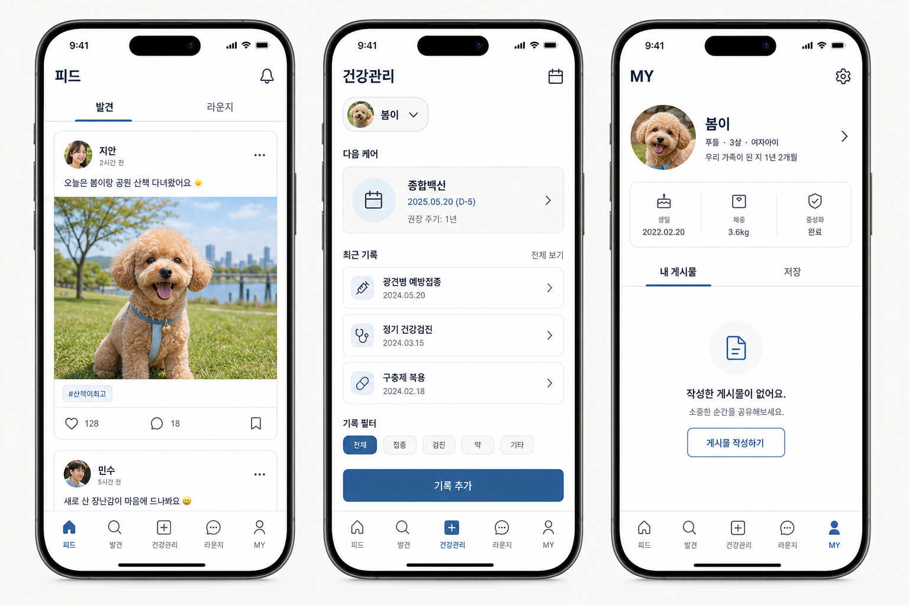

### 채택할 요소

- 강한 화면 제목과 읽기 쉬운 본문 대비
- warm off-white + white surface + deep navy의 절제된 사용
- shadow보다 얇은 border와 간격으로 계층 표현
- 피드 사진, 다음 케어, 대표 반려동물처럼 화면별 핵심 데이터를 상단에 배치
- 텍스트가 있는 MY 탭과 명확한 빈 상태 CTA
- 한 icon family와 일정한 row/card 문법

### 그대로 채택하지 않을 요소

- 생성 시안의 하단 탭 순서와 라벨
- 가상의 날짜·기록·사용자 정보
- 세부 아이콘과 모든 문구
- 실제 앱의 홈·AI 계약과 맞지 않는 정보구조

## 2. 하위 작업 화면 방향

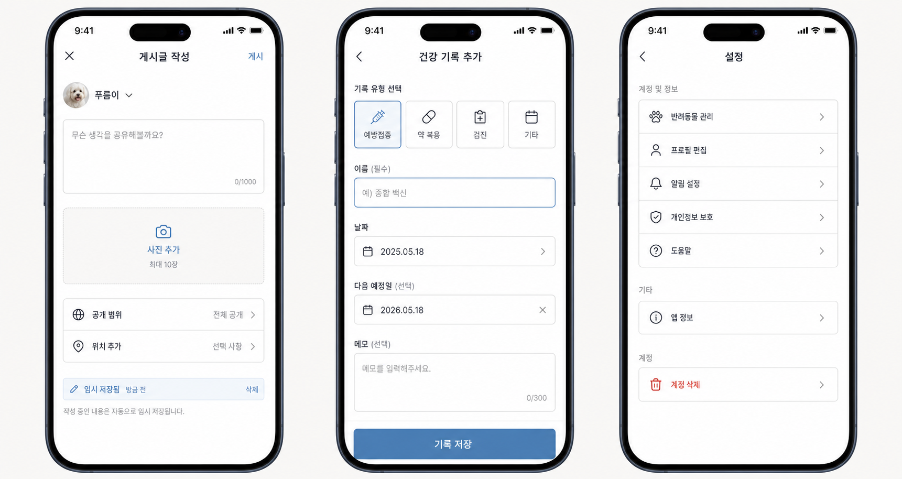

### 핵심 제안

- 게시글 작성, 기록 추가, 설정에는 하단 탭과 중앙 FAB가 없다.
- 작업 화면은 하나의 제목, 하나의 primary action, 예측 가능한 back/close를 사용한다.
- 폼은 필수값, 선택값, 도움말, 오류를 같은 위치와 문법으로 표현한다.
- 설정은 작은 색상 박스 아이콘을 반복하기보다 native outline row로 단순화한다.
- destructive action은 일반 정보와 분리한다.

## 3. 사용자 결정이 필요한 네 가지

### D1. 중앙 AI 진입 방식

- **A — 일반 탭 (권고):** 다섯 탭의 크기와 위계를 동일하게 유지한다. 가장 안정적이고 신뢰감이 높다.
- **B — root-only 강조:** 현행 중앙 paw를 48pt 이하로 축소하고 루트 5화면에서만 표시한다.

### D2. 브랜드 톤

- **A — 차분한 케어 에디토리얼 (권고):** navy, warm white, 실제 반려동물 콘텐츠 중심. 건강·개인정보 신뢰에 유리하다.
- **B — 밝은 펫 라이프스타일:** 더 밝은 sky blue와 일러스트를 사용한다. 친근하지만 장난감 앱처럼 보이지 않게 제한한다.

### D3. 건강 첫 화면

- **A — 다음 케어 우선 (권고):** 예방접종·검진·투약 일정과 최근 기록을 먼저 보여준다.
- **B — 기록 타임라인 우선:** 최근 기록과 필터를 먼저 보여주고 일정은 보조한다.

### D4. MY identity

- **A — 대표 반려동물 중심 (권고):** pet identity와 관리 CTA를 상단에 두고 사용자 profile은 보조한다.
- **B — 사용자 profile 중심:** 현행 SNS profile 구조를 유지하고 반려동물을 별도 섹션으로 둔다.

## 4. 방향 합의 후 제작할 정확한 목업 세트

### Set A — Navigation + Auth

1. root tab shell
2. task/detail shell
3. 로그인 선택
4. 이메일 로그인·회원가입
5. 약관 동의·저장 실패
6. 프로필 설정
7. 첫 반려동물 등록

#### Set A v2 렌더링

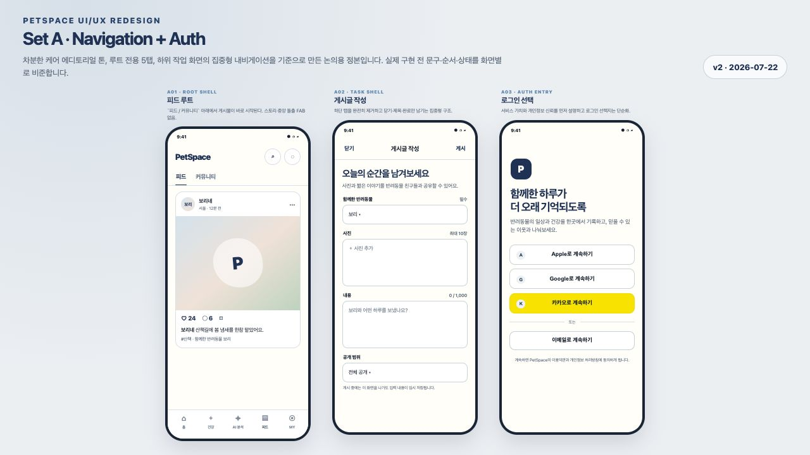

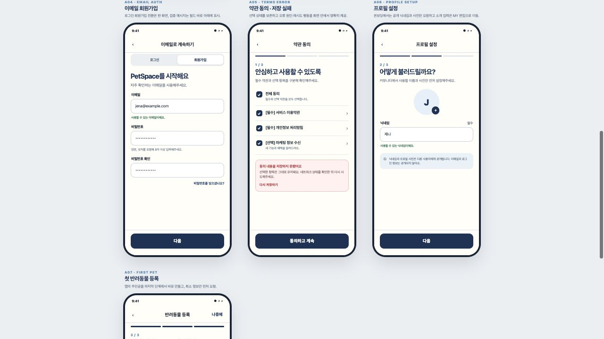

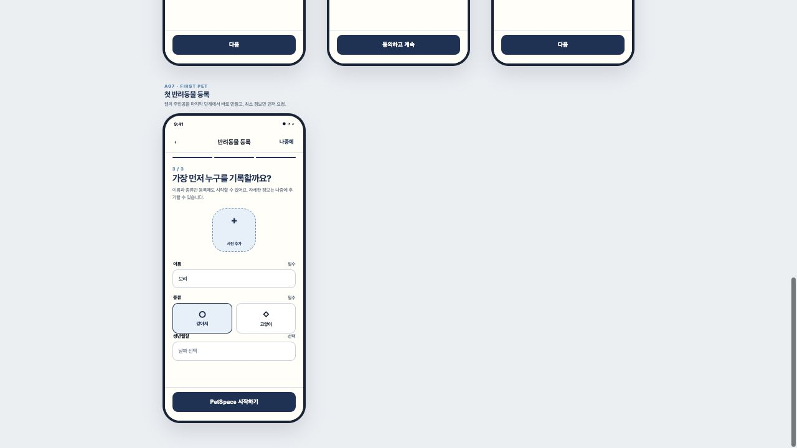

원본 코드 목업: [`set-a-navigation-auth-v1.html`](set-a-navigation-auth-v1.html)

#### Set A 단독 3회 리뷰

| 패스 | 관점 | 결과 |
|---|---|---|
| 1 | 정보구조·내비게이션 | 루트에만 5탭, task/detail에는 하단 탭 없음. `피드 / 커뮤니티` 명칭 반영 |
| 2 | 신뢰 문구·실패 회복 | 공개 닉네임 계약, 약관 선택 보존·재시도, 임시저장 안내 반영 |
| 3 | 시각 위계·접근성 | 44pt header action, 54pt primary action, 보조 텍스트 대비, 명시적 접근성 이름 반영 |

#### 사용자 확정 사항

1. 첫 반려동물 등록의 `나중에`를 허용하고, 등록하지 않은 사용자는 MY에서 다시 안내한다.
2. `한 줄 소개`는 온보딩에서 제외하고 MY 프로필 편집으로 이동한다.
3. 이메일 화면은 `로그인 / 회원가입` segmented 구조를 유지한다.
4. 피드 스토리 기능은 이번 범위에 포함하지 않는다.

### Set B — Pet + MY

1. 반려동물 관리 0/1/여러 마리
2. 등록 1단계·2단계
3. 편집·삭제 확인
4. MY content/empty/error
5. 저장 컬렉션
6. 프로필 편집
7. 설정·알림·개인정보

#### Set B v1 렌더링

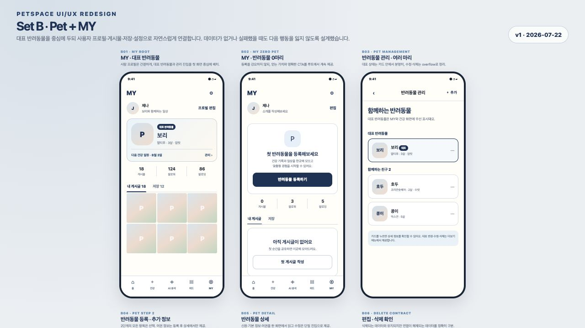

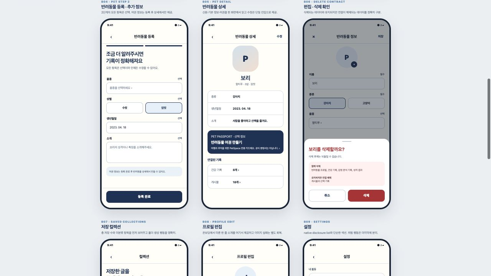

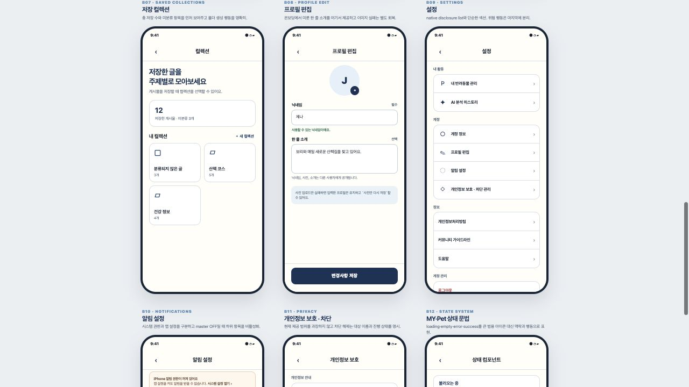

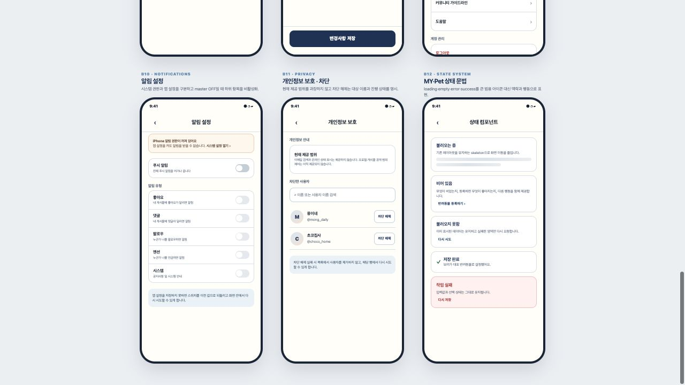

원본 코드 목업: [`set-b-pet-my-v1.html`](set-b-pet-my-v1.html)

#### Set B 단독 3회 리뷰

| 패스 | 관점 | 결과 |
|---|---|---|
| 1 | 정보구조·사용자 여정 | MY → 대표 반려동물 → 상세·관리 → 기록으로 연결. 0마리 상태에서도 앱 이용과 등록 CTA를 함께 유지 |
| 2 | 데이터·파괴적 작업 계약 | 삭제 시 함께 삭제되는 건강·감정·성격 데이터와 연결만 해제되는 게시물·산책 기록을 분리 표기. 여권은 공식 증명서가 아님을 명시 |
| 3 | 시각 위계·접근성·상태 | task 화면 하단 탭 제거, 텍스트 탭·44pt action·master switch 종속 상태·영역별 retry 적용 |

#### Set B 사용자 확정 사항

1. `대표 반려동물`을 계정 단위로 영구 저장한다.
2. MY 대표 반려동물 카드에 `다음 건강 일정`을 표시한다.
3. 반려동물 삭제 확인에 데이터 영향 범위를 B06 문구대로 고정한다.

대표 반려동물 영구 저장은 migration 파일과 앱 계약을 별도 구현 범위로 작성하되 운영 DB에는 자동 적용하지 않는다.

### Set C — Feed + Social

1. 피드
2. 커뮤니티·카테고리
3. 게시글 작성 empty/filled/pending/error
4. 게시물 상세
5. 댓글·답글
6. 검색 4종 결과
7. 신고·차단·저장 collection
8. 알림

#### Set C v1 렌더링

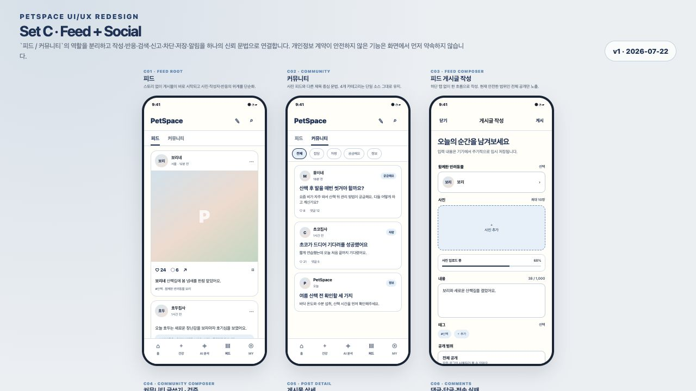

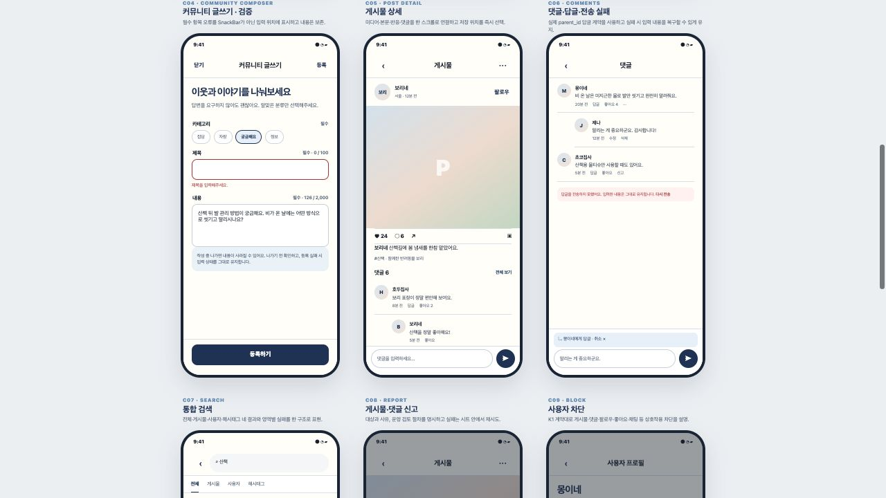

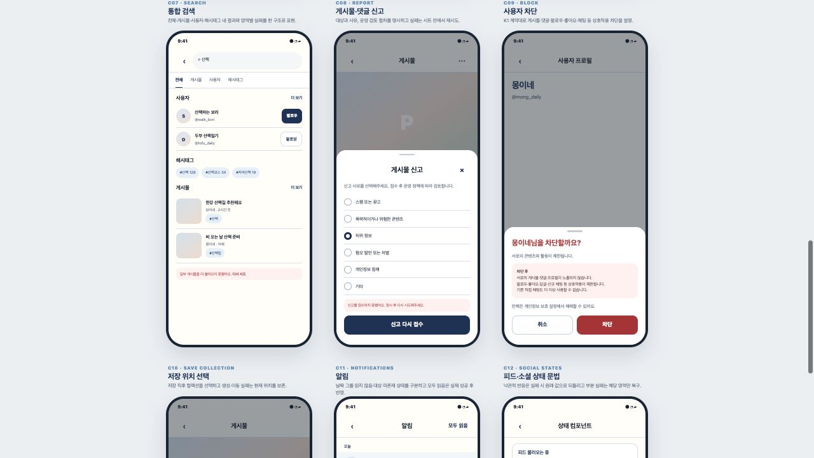

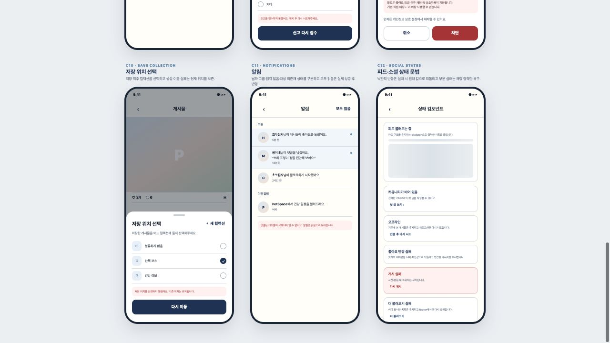

원본 코드 목업: [`set-c-feed-social-v1.html`](set-c-feed-social-v1.html)

#### Set C 단독 3회 리뷰

| 패스 | 관점 | 결과 |
|---|---|---|
| 1 | 정보구조·사용자 여정 | `피드 / 커뮤니티` 역할을 사진 중심 근황과 주제 중심 대화로 분리. 스토리형 행은 넣지 않고 작성·상세 화면에서 하단 탭 제거 |
| 2 | 데이터·보안 계약 | K1 차단·신고 사유·부모 댓글 답글 계약을 보존. 공개 AI 감정은 백분율을 노출하지 않으며, audience가 안전하게 강제되기 전에는 `팔로워만`을 숨김 |
| 3 | 시각 위계·접근성·복구 | 사진 최대 10장의 실제 picker 계약, 인라인 검증, 44pt action, 영역별 재시도와 낙관적 UI 실패 복구를 반영 |

#### Set C 사용자 확정 사항

1. `팔로워만` 공개 범위는 K1과 함께 RLS·RPC·직접 조회에서 안전하게 강제될 때까지 숨긴다.
2. 현재 피드 작성은 사진 최대 10장만 지원하며 동영상 업로드를 약속하지 않는다.
3. 커뮤니티 제목·본문은 기존 `caption` 저장 형식을 유지하면서 첫 문단을 제목으로 안전하게 파싱해 시각적으로 분리한다.

### Set D — Health + Chat

1. 건강 0/1/여러 기록
2. 기록 추가 5유형
3. 기록 편집·삭제
4. 변화 추이·PDF·알림 안내
5. 채팅 목록 empty/content/error
6. 새 채팅 1:1/그룹
7. 채팅 상세 text/image/failure
8. 방 설정 admin/member

#### Set D v1 렌더링

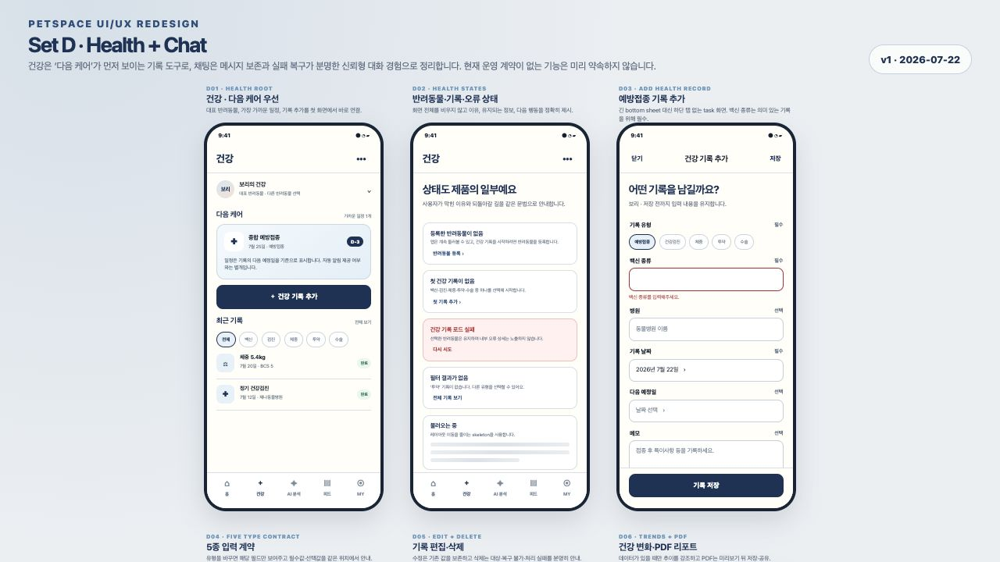

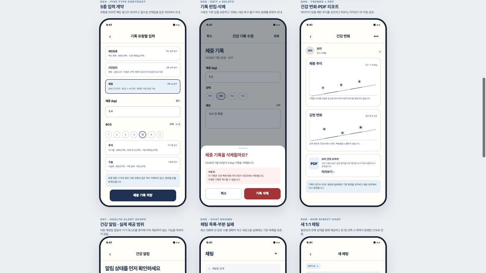

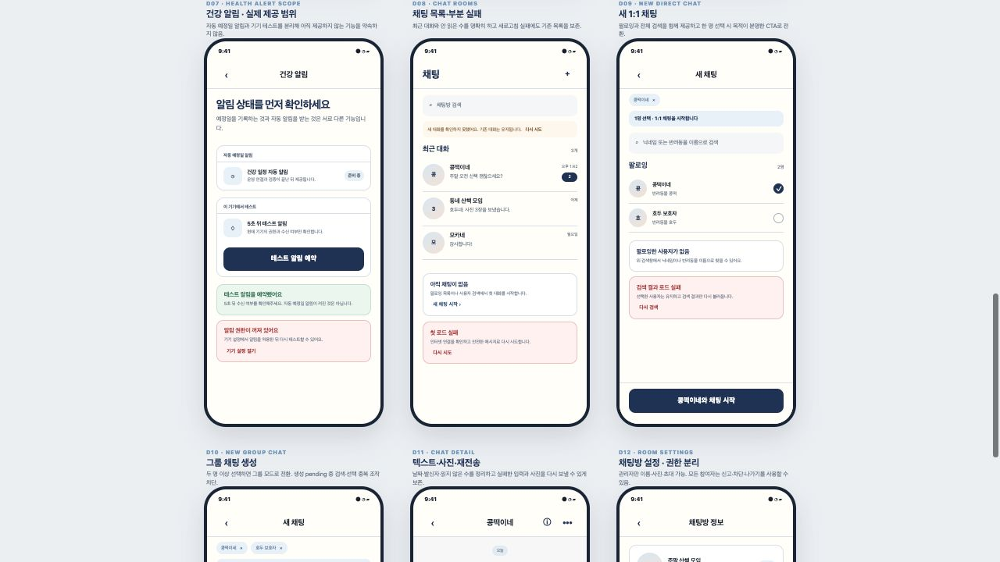

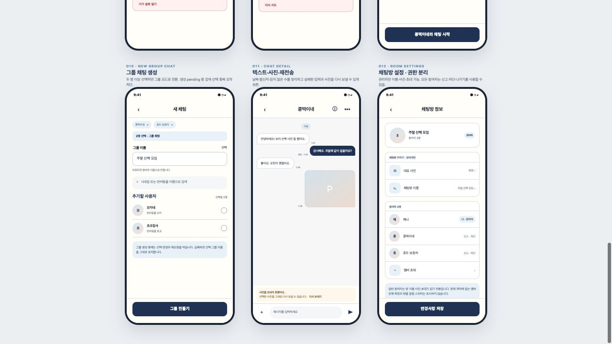

원본 코드 목업: [`set-d-health-chat-v1.html`](set-d-health-chat-v1.html)

#### Set D 단독 3회 리뷰

| 패스 | 관점 | 결과 |
|---|---|---|
| 1 | 정보구조·사용자 여정 | 건강은 대표 반려동물 → 다음 케어 → 기록 추가 → 최근 기록 순으로 정리. 긴 건강 입력과 채팅 생성·상세·설정은 하단 탭 없는 task 화면으로 분리 |
| 2 | 데이터·보안 계약 | H1 반려동물 소유자 범위와 안전한 오류 문구, 5종 기록·PDF 계약을 보존. 자동 예정일 알림은 `준비 중`으로 분리하고 K1 차단 필터·신고·관리자 권한을 유지 |
| 3 | 시각 위계·접근성·복구 | 44pt 이상 action, 필수/선택 인라인 검증, 기존 목록·입력·사진 보존형 재시도, empty/loading/offline/permission/destructive 상태를 같은 문법으로 반영 |

#### Set D 사용자 확정 사항

1. 건강 기록 추가·수정을 긴 bottom sheet가 아닌 full task screen으로 전환한다.
2. `예방접종`의 백신 종류를 신규 입력에서 필수로 검증하되 기존 빈 값 기록은 그대로 열 수 있게 호환한다.
3. 자동 예정일 알림은 운영 연결이 검증될 때까지 `준비 중`으로 유지하고 현재는 5초 기기 테스트만 제공한다.
4. 채팅 사진은 한 번에 최대 10장으로 제한하고 실패 시 같은 선택을 재전송할 수 있게 유지한다.
5. 실제 저장 계약이 없는 그룹 멤버 강제 퇴장과 방별 알림 스위치는 이번 UI에서 만들지 않는다.

각 세트는 happy path만 그리지 않고 loading, empty, validation, offline, destructive confirmation, success 상태를 함께 제시한다.

## 5. 합의 후 작업지시서 전환 규칙

- 사용자 승인한 목업의 screen ID와 revision을 work order에 기록한다.
- production·test 파일을 개별 경로로 고정한다.
- 디자인 토큰과 공용 컴포넌트를 먼저 구현하고 화면별 예외를 최소화한다.
- 한 wave에서 root shell, auth, feed, health를 동시에 수정하지 않는다.
- wave마다 format, analyze, 집중 test, 전체 test, iOS no-codesign build, 시뮬레이터 캡처를 실행한다.
