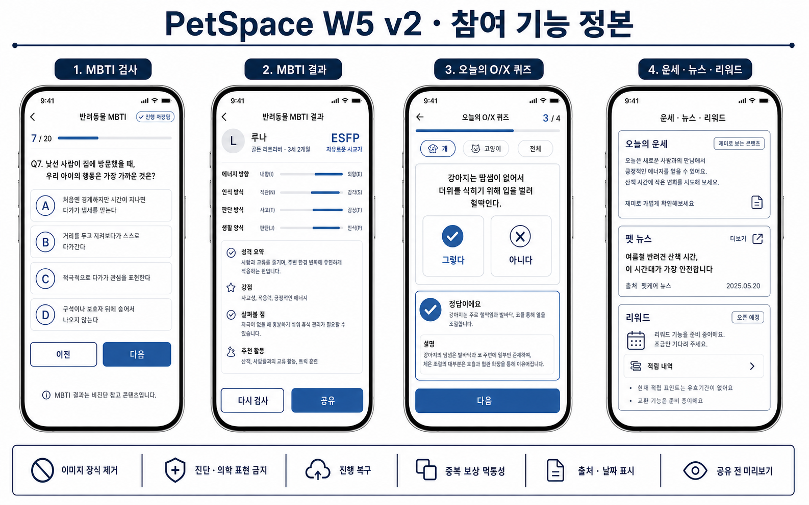
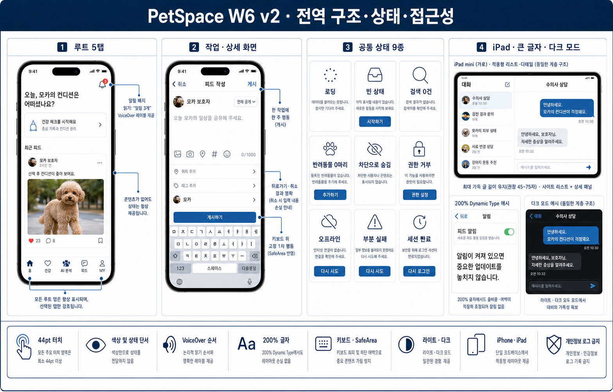

# 2026-08-04 전체 앱 추가 목업

이 폴더는 기존 Set A~D와 2026-08-03 W1 목업에서 빠져 있던 영역만 보완한다.
실제 구현 범위는 사용자 승인 후 배치별 manifest에서 다시 고정한다.

## W5 참여 기능

- MBTI: 20문항 진행·자동 저장·참고 콘텐츠 고지
- O/X 퀴즈: 색상 외 정오 단서·해설·멱등 보상
- 운세: 재미 콘텐츠 라벨, 의료 표현 금지
- 뉴스: 출처·날짜·외부 링크
- 리워드: 실제 교환 계약 전 `오픈 예정`, 구매 UI 금지, 잔액 아래 적립 이력 진입
- 주요 버튼: 그라데이션 없이 `#2F6399` 단색과 흰색 텍스트

작은 문구와 가상 데이터는 시각 비교용이다. 실제 구현 문구와 계약은
`docs/reviews/2026-08-04-full-app-uiux-master-plan.md`를 정본으로 사용한다.

## W6 전역 구조·상태·접근성

- 루트 5탭, AI 분석 발바닥 아이콘은 일반 탭 위계
- task/detail의 한 주 행동과 키보드 SafeArea
- 로딩/빈 상태/검색 0건/반려동물 0마리/차단 숨김/권한 거부/오프라인/
  부분 실패/세션 만료의 9개 상태 분리
- iPad list-detail, 200% 글자, dark mode

v1 이미지는 검토 이력을 위해 남긴다. 구현 정본은 v2 이미지와
`docs/reviews/2026-08-04-full-app-uiux-master-plan.md`다.

Home과 AI 분석 결과 내용은 이 목업으로 변경 승인된 것이 아니다. 두 영역은
탐색·상태·적응형 계약만 기획하며 구현은 별도 사용자 승인까지 잠근다.
